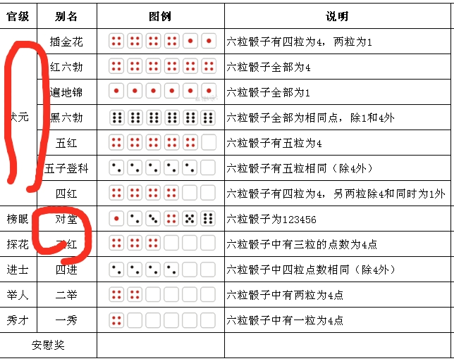

# bobing
# 博饼（跋饼），是起源于厦门的中秋传统活动随之传播至闽南地区，始于清初，是一种独特的月饼文化，也是闽南人对历史的一种传承。相传，中秋博饼，是郑成功屯兵鼓浪屿时为解士兵的中秋相思之情、激励鼓舞士气而发明的。于是，一代一代传下来，就成了如今闽南地区独具特色的民间习俗。
# 游戏规则：
# 
# 通过传入的参数确定模拟的次数
# 例如，在控制台中输入 **java -jar ./bobing.jar 5000** 即可模拟5000次
# 也可以写成.bat（windows）格式的批处理文件
# 模拟结果会打印在控制台，细节会保存在logs/文件夹里